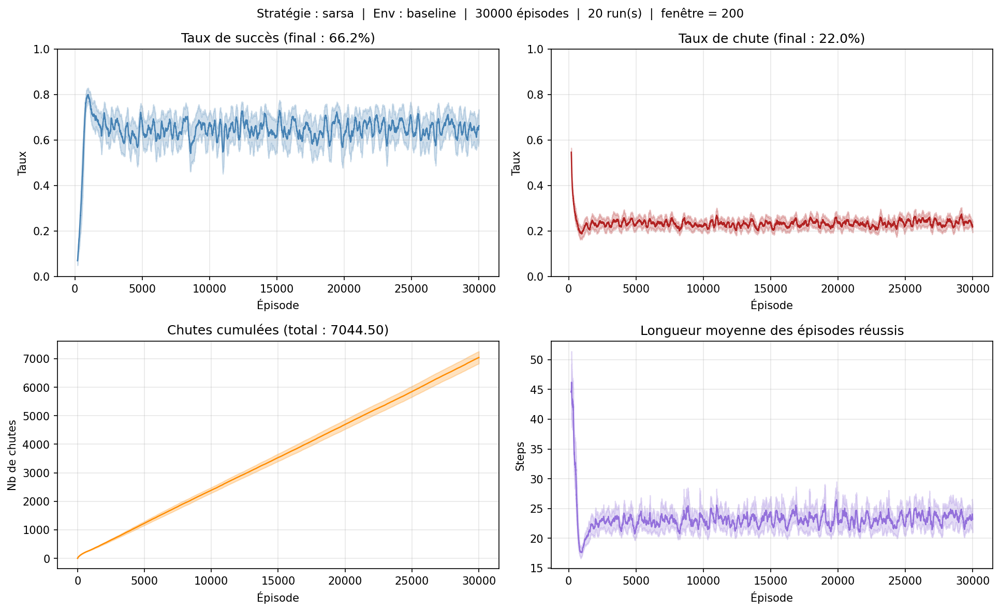
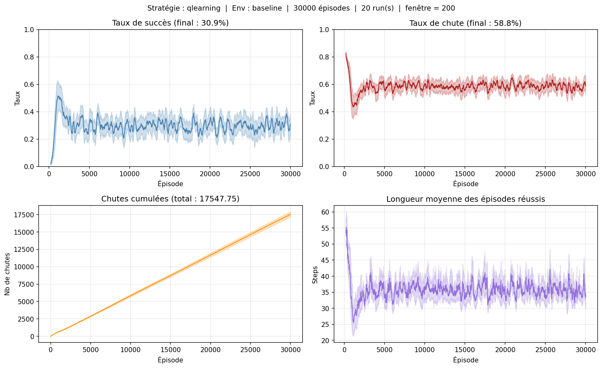
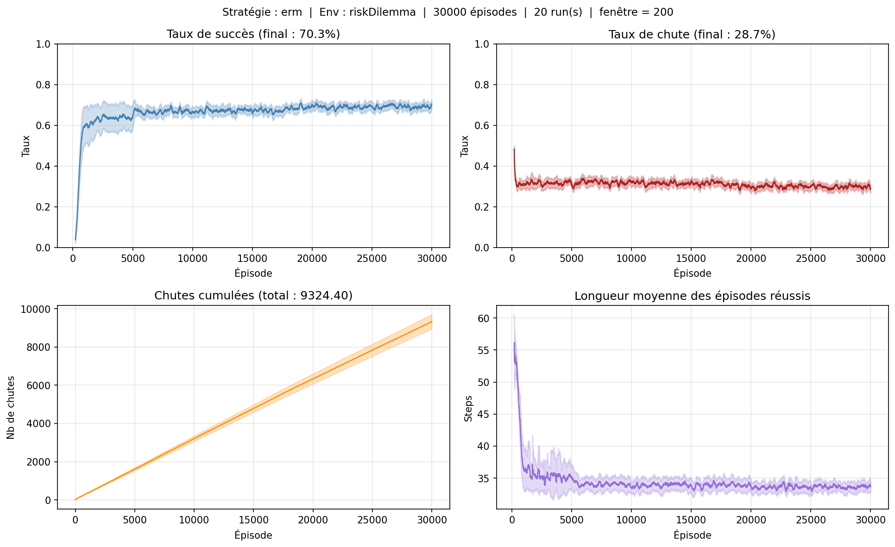
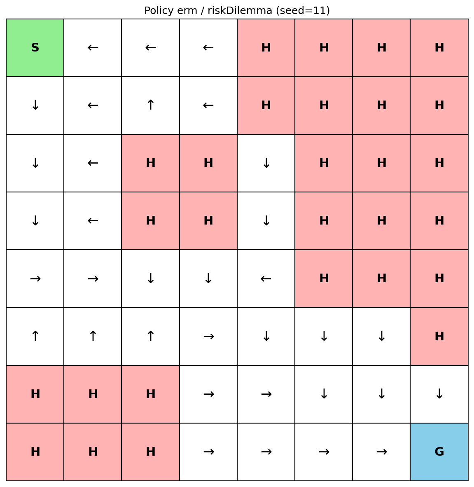

# RL FrozenLake Benchmark

Benchmarking risk-aware reinforcement learning on Gymnasium's FrozenLake 8x8. Compares **SARSA**, **Q-Learning**, and **ERM Q-Learning** (Entropic Risk Measure, [Su et al. 2025](https://arxiv.org/abs/2306.16860)) across three grid configurations designed to isolate the effects of stochasticity and topology on learned policies.

> By [@audrey-dv](https://github.com/audrey-dv) & [@leopoldch](https://github.com/leopoldch)

## Environments

Three 8x8 grids with increasing risk levels:

- **baseline** &mdash; 5% slip, 7 holes. Low-risk reference grid.
- **slippery** &mdash; 30% slip, same 7 holes. Tests the effect of stochasticity alone.
- **riskDilemma** &mdash; 30% slip, 28 holes. Constrained topology that forces a choice between a safe detour and a risky shortcut.

## Results

*30,000 episodes, 20 seeds, 95% CI. Smoothed with a 200-episode window.*

### Baseline &mdash; SARSA vs Q-Learning

SARSA converges to ~66% success with a low fall rate; Q-Learning stays around 31% success and falls into holes twice as often.




### riskDilemma &mdash; where ERM shines

On the constrained grid, ERM Q-Learning reaches **70% success** vs ~54% for SARSA and ~41% for Q-Learning, with shorter successful trajectories.



### Learned policies on riskDilemma

SARSA takes a cautious detour; ERM finds a more direct path while keeping a comparable fall rate.

| SARSA | ERM |
|:---:|:---:|
|  |  |

### Summary table

| Environment | Algorithm | Success (%) | Fall (%) |
|---|---|---|---|
| baseline | SARSA | 64.27 &pm; 0.47 | 23.48 &pm; 0.72 |
| baseline | Q-Learning | 29.95 &pm; 0.73 | 58.49 &pm; 1.29 |
| baseline | ERM | 59.67 &pm; 4.01 | 37.30 &pm; 3.38 |
| riskDilemma | SARSA | 38.15 &pm; 2.36 | 23.75 &pm; 1.16 |
| riskDilemma | Q-Learning | 39.59 &pm; 6.67 | 31.64 &pm; 4.78 |
| riskDilemma | **ERM** | **66.30 &pm; 2.21** | 31.08 &pm; 1.25 |

## Installation

```bash
uv sync
source .venv/bin/activate
```

## Usage

```bash
python main.py --env <ENV> --strategy <STRATEGY> --episodes <N> --iterations <N> [--plot] [--render]
```

| Argument | Default | Description |
|---|---|---|
| `--env` | `random` | `baseline`, `slippery`, `riskDilemma`, `corridor`, `random` |
| `--strategy` | `random` | `sarsa`, `qlearning`, `erm`, `random` |
| `--episodes` | `60000` | Training episodes |
| `--iterations` | `20` | Independent runs (different seeds) |
| `--plot` | off | Save training curves and policy maps |
| `--render` | off | Display the environment live |
| `--window` | `200` | Smoothing window for curves |
| `--save-dir` | `figures` | Output directory for plots |

### Examples

```bash
# Full benchmark run
python main.py --env riskDilemma --strategy erm --episodes 30000 --iterations 20 --plot

# Quick test
python main.py --env baseline --strategy sarsa --episodes 5000 --iterations 5 --plot

# Visual mode
python main.py --env baseline --episodes 5 --render
```

## Code Formatting

```bash
uv run black .
```
